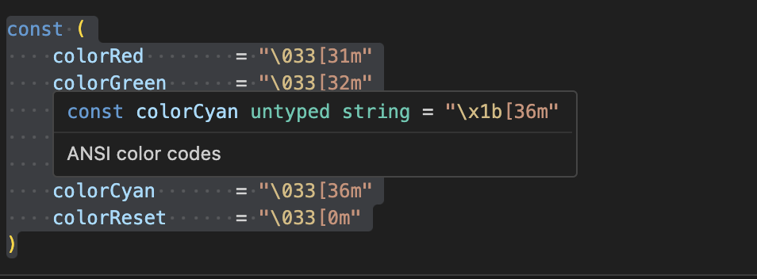
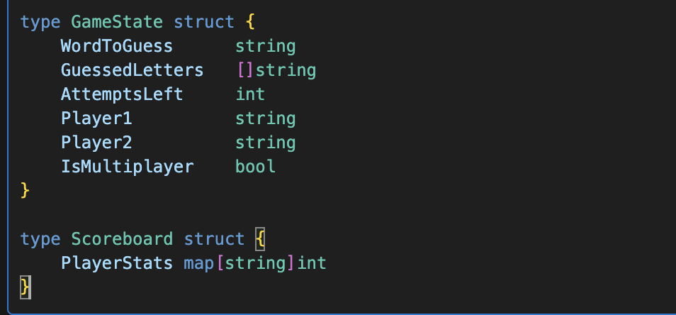
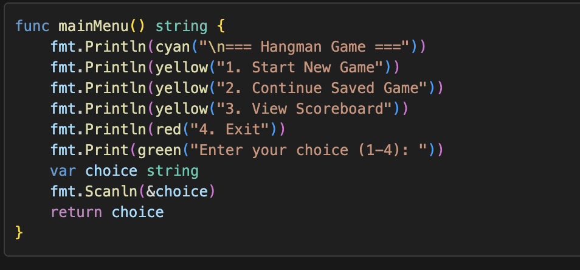
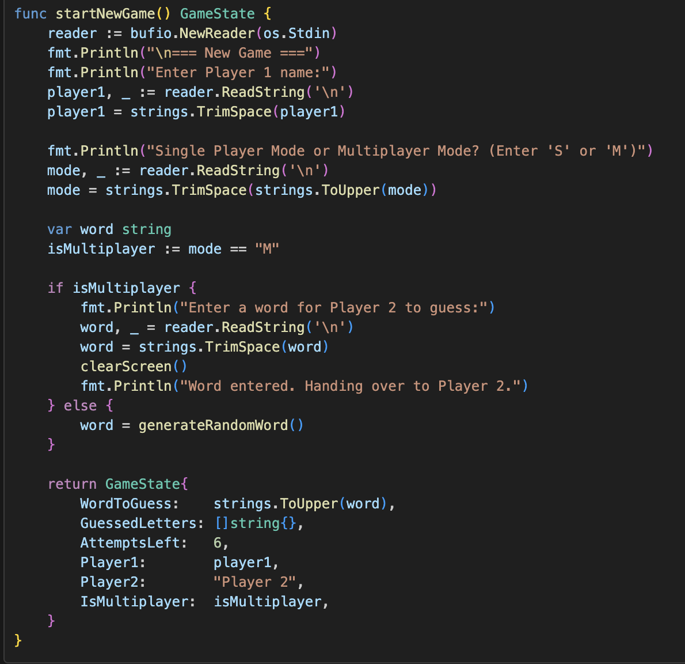
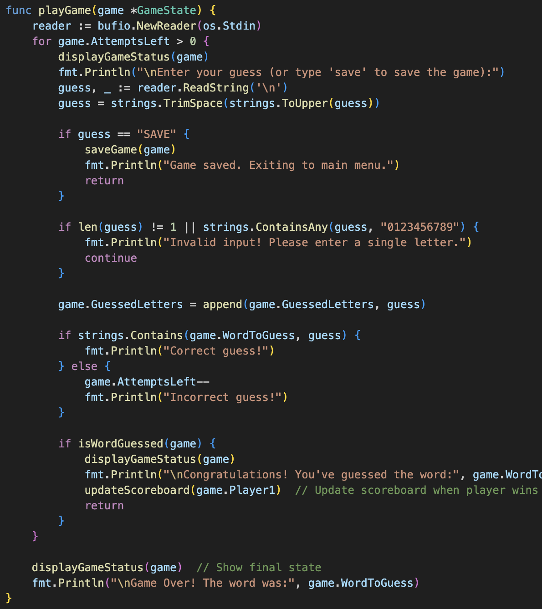
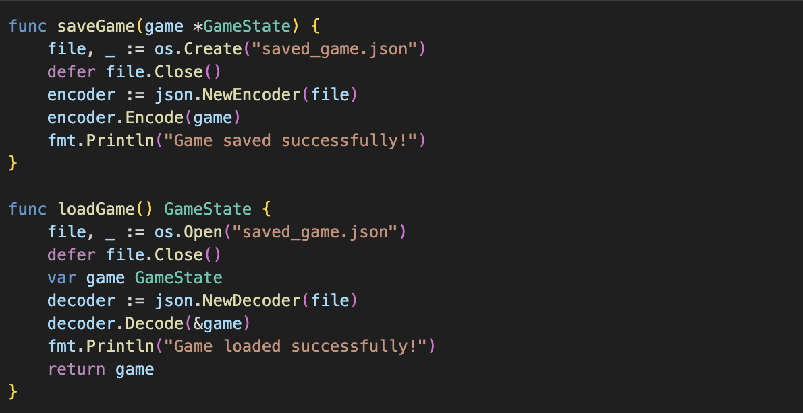
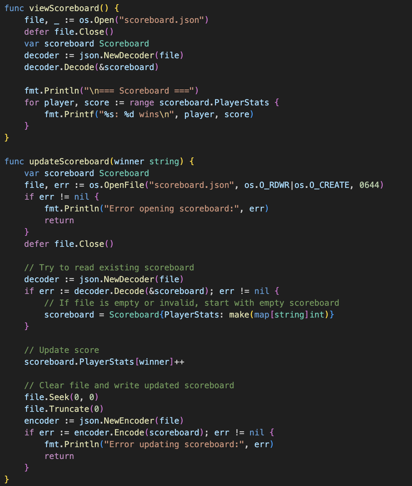

# Hangman Game Documentation

## 1. Introduction

Hangman is a classic word-guessing game enjoyed by people of all ages for many years. The origins of Hangman are somewhat unclear, but it is believed to have been played as early as the 19th century. The game involves one player thinking of a word and the other player(s) trying to guess it by suggesting letters within a certain number of attempts. If the guessing player suggests a letter that is in the word, it is revealed in its correct position(s). If the letter is not in the word, the player loses an attempt. The game continues until the word is guessed or the player runs out of attempts, at which point a hangman figure is completed.

## 2. Research

During the research phase, various implementations of the Hangman game in different programming languages were explored. Here are a few examples:

- **Python**: A simple console-based Hangman game using basic input/output functions and loops.
- **JavaScript**: A web-based Hangman game using HTML, CSS, and JavaScript for a graphical user interface.
- **Java**: A Hangman game implemented using Java Swing for a graphical user interface.
- **C++**: A console-based Hangman game using standard input/output and file handling for word lists.

These examples provided insights into different ways to handle user input, display game status, and manage game state.

## 3. Implementation

The Hangman game was implemented in Go, a statically typed, compiled programming language designed for simplicity and efficiency. The implementation is organized into several functions, each handling a specific aspect of the game. Below is an explanation of the key components:

### ANSI Color Codes

To enhance the user experience, ANSI color codes are used to display colored text in the console.

### Game State and Scoreboard

Two structs, `GameState` and `Scoreboard`, are defined to manage the game state and player scores.

### Main Menu

The `mainMenu` function displays the main menu and prompts the user to select an option.

### Starting a New Game

The `startNewGame` function initializes a new game by prompting the user for player names and game mode.

### Playing the Game

The `playGame` function manages the main game loop, handling user guesses and updating the game state.

### Saving and Loading the Game

The `saveGame` and `loadGame` functions handle saving and loading the game state to and from a JSON file.

### Viewing and Updating the Scoreboard

The `viewScoreboard` and `updateScoreboard` functions manage the display and update of player scores.

## 4. Conclusion

Implementing the Hangman game in Go was a valuable learning experience. It provided an opportunity to practice various programming concepts, including file handling, user input, and game state management. Some challenges faced during the implementation included handling user input validation and managing the game state across different functions. Overall, this project helped develop skills in Go programming and reinforced the importance of writing clean, modular code.
